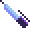

<p align='center'>
    <a href='https://store.steampowered.com/app/844590/Hypnospace_Outlaw/'></img></a>
</p>

<table align='center'>
    <tr>
        <td><p align='center'></p></td>
        <td><p align='center'></p></td>
        <td><p align='center'></p></td>
        <td><p align='center'></p></td>
    </tr>
    <tr>
        <td><p align='center'></p></td>
        <td><p align='center'></p></td>
        <td><p align='center'></p></td>
        <td><p align='center'></p></td>
    </tr>
    <tr>
        <td><p align='center'></p></td>
        <td><p align='center'></p></td>
        <td><p align='center'></p></td>
        <td><p align='center'></p></td>
    </tr>
        <tr>
        <td><p align='center'></p></td>
        <td><p align='center'></p></td>
        <td><p align='center'></p></td>
        <td><p align='center'></p></td>
    </tr>
    <tr>
        <td><p align='center'></p></td>
        <td><p align='center'></p></td>
        <td><p align='center'></p></td>
        <td><p align='center'></p></td>
    </tr>
</table>

# Usage

## Manual Installation

1. Download this repository ([link](https://github.com/Bergbok/HypnOS-Linux-Cursor/archive/refs/heads/main.zip))
2. Extract the `HypnOS` folder from the `cursors` folder to either:
    - ~/.icons/
    - ~/.local/share/icons/
    - /usr/share/icons/
3. Select the cursor through your system's settings.

## Install Script

```bash
curl -fsSL https://raw.githubusercontent.com/Bergbok/HypnOS-Linux-Cursor/main/install | bash
```

# Credits

- All assets (except those linked below) are from [Hypnospace Outlaw](https://store.steampowered.com/app/844590/Hypnospace_Outlaw/), made by  and property of Jay Tholen.
- [rat](src/assets/rat.png) from [3D Movie Maker](https://github.com/foone/3DMMForever)
- [pirate](src/assets/pirate.png) from [BTTV](https://betterttv.com/emotes/64c72ff55f4802d5b15eefb4) - [lore](https://youtu.be/Vegg1ncoPGw)
- [man](src/assets/man.gif) from [jerma.io](https://jerma.io)